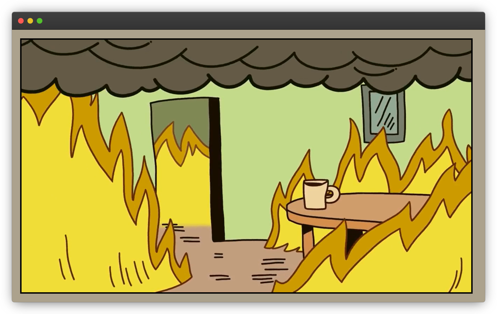

# 🔥 This is fine

> *Sample project for academic and learning purposes*

This repository is a hands-on demo of how to build and publish Docker images. Perfect for learning containerization fundamentals without the hassle.


## 📄 Dockerfile

```dockerfile
FROM nginx:alpine

COPY index.html /usr/share/nginx/html/index.html
COPY video.mp4 /usr/share/nginx/html/video.mp4

EXPOSE 80
```

## 📦 Build Docker image

```shell
docker build -t thisisfine .
```

## ⚡ Run Docker image

```shell
docker run -d -p 8080:80 thisisfine
```

Once the container is running, open your browser and navigate to [http://localhost:8080](http://localhost:8080) to see the magic happen



